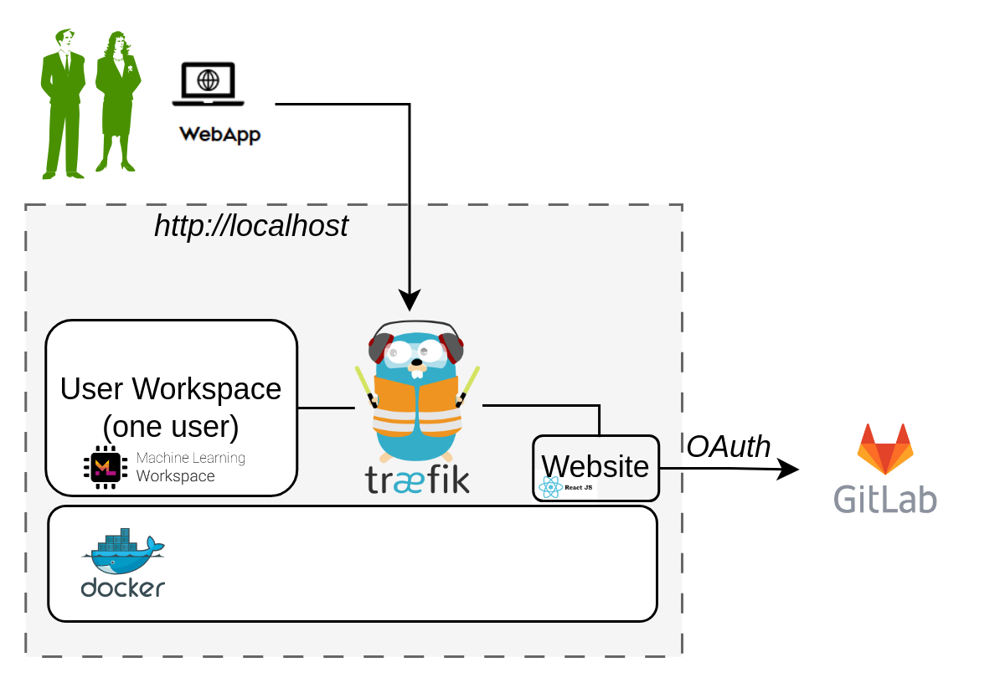

# Install DTaaS on localhost

The installation instructions provided in this README are
ideal for running the DTaaS on both localhost.
This installation is ideal for single users intending to use
DTaaS on their own computers.

## Design

An illustration of the docker containers used and the authorization
setup is shown here.

<!-- markdownlint-disable-next-line -->


## Requirements

The installation requirements to run this docker version of the DTaaS are:

- docker desktop / docker CLI with compose plugin
- User account on <https://gitlab.com>

## Configuration

:clipboard: file pathnames

1. The filepaths shown here follow Linux convention.
   The installation procedures also work with Windows
   paths.
1. The description below refers to filenames. All the file
   paths mentioned below are relatively to the top-level
   **DTaaS** directory.

### OAuth for Client (OPTIONAL)

This step is needed only if the DTaaS application needs
to be linked with your locally hosted gitlab instance.

:clipboard: The frontend website requires authorization.
The default authorization configuration works for <https://gitlab.com>.
If you desire to use locally hosted gitlab instance, please see
the client config file (`deploy/config/client/env.local.js`) needs to be updated.

 ```js
  if (typeof window !== 'undefined') {
    window.env = {
      REACT_APP_ENVIRONMENT: 'prod',
      REACT_APP_URL: 'https://foo.com/',
      REACT_APP_URL_BASENAME: '',
      REACT_APP_URL_DTLINK: '/lab',
      REACT_APP_URL_LIBLINK: '',
      REACT_APP_WORKBENCHLINK_VNCDESKTOP: '/tools/vnc/?password=vncpassword',
      REACT_APP_WORKBENCHLINK_VSCODE: '/tools/vscode/',
      REACT_APP_WORKBENCHLINK_JUPYTERLAB: '/lab',
      REACT_APP_WORKBENCHLINK_JUPYTERNOTEBOOK: '',
      REACT_APP_CLIENT_ID: '1be55736756190b3ace4c2c4fb19bde386d1dcc748d20b47ea8cfb5935b8446c',
      REACT_APP_AUTH_AUTHORITY: 'https://gitlab.foo.com/',
      REACT_APP_REDIRECT_URI: 'https://foo.com/Library',
      REACT_APP_LOGOUT_REDIRECT_URI: 'https://foo.com/',
      REACT_APP_GITLAB_SCOPES: 'openid profile read_user read_repository api',
    };
  };
  ```

The `REACT_APP_CLIENT_ID` and `REACT_APP_AUTH_AUTHORITY` information comes from the
[gitlab OAuth](https://docs.gitlab.com/ee/integration/oauth_provider.html)
creation help page. These two values need to be updated.

### Docker Compose

The docker compose configuration is in `deploy/docker/.env.local`;
it is a sample file.
It contains environment variables
that are used by the docker compose files.
It can be updated to suit your local installation scenario.
It contains the following environment variables.

Edit all the fields according to your specific case.

  | URL Path | Example Value | Explanation |
  |:------------|:---------------|:---------------|
  | DTAAS_DIR | '/home/Desktop/DTaaS' | Full path to the DTaaS directory. This is an absolute path with no trailing slash. |
  | username1 | 'user1' | Your gitlab username |
  | CLIENT_CONFIG | '/home/Desktop/DTaaS/deploy/config/client/env.local.js' | Full path to env.js file for client |

:clipboard: The path examples given here are for Linux OS.
These paths can be Windows OS compatible paths as well.

### Create User Workspace

The existing filesystem for installation is setup for `user1`.
A new filesystem directory needs to be created for the selected user.

Please execute the following commands from the top-level directory
of the DTaaS project.

```bash
cp -R files/user1 files/username
```

where _username_ is the selected username registered on <https://gitlab.com>.

## Run

The commands to start and stop the appliation are:

```bash
docker compose -f compose.local.yml --env-file .env.local up -d
docker compose -f compose.local.yml --env-file .env.local down
```

To restart only a specific container, for example `client``

```bash
docker compose -f compose.local.yml --env-file .env up -d --force-recreate client
```

## Use

The application will be accessible at:
<http://localhost> from web browser.
Sign in using your <https://gitlab.com> account.

All the functionality of DTaaS should be available to you
through the single page client now.

## Limitations

The [library microservice](https://hub.docker.com/r/intocps/libms/tags)
is not included in the localhost installation scenario.

## References

Image sources:
[Traefik logo](https://www.laub-home.de/wiki/Traefik_SSL_Reverse_Proxy_f%C3%BCr_Docker_Container),
[ml-workspace](https://github.com/ml-tooling/ml-workspace),
[reactjs](https://krify.co/about-reactjs/),
[gitlab](https://gitlab.com)
